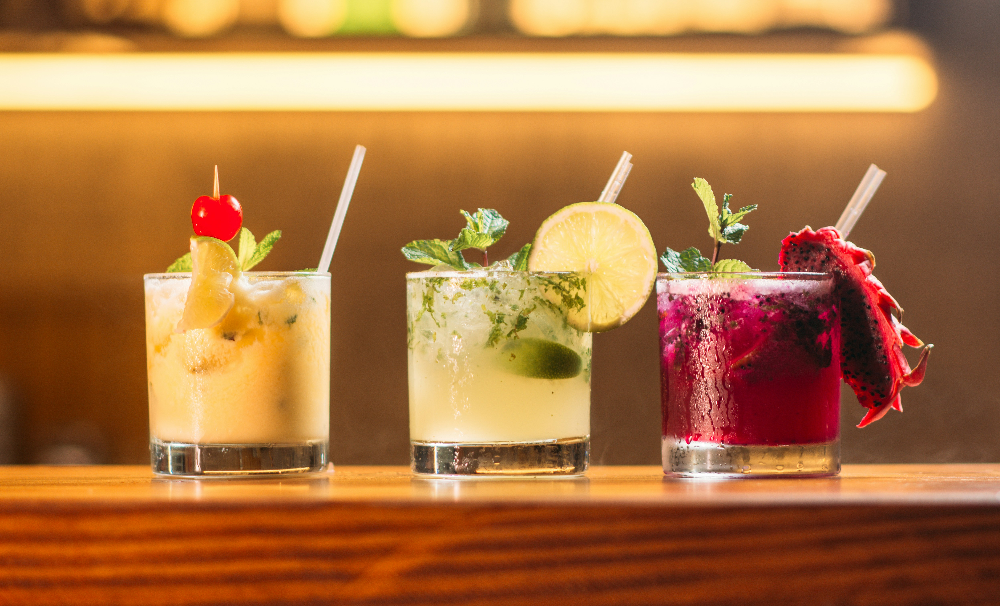

# Menu
## Pizze

| Lp. | Pizza            | Składniki                                   | Cena  |
|-----|------------------|---------------------------------------------|-------|
| 1.  | Pizza Gondor     | mozzarella, szynka, pieczarki               | 30 zł |
| 2.  | Pizza Rohan      | kurczak, kukurydza, czerwona cebula          | 32 zł |
| 3.  | Pizza Rivendell  | feta, szpinak, suszone pomidory              | 35 zł |
| 4.  | Pizza Shire      | boczek, ziemniaki, cebula                    | 35 zł |
| 5.  | Pizza Mordor     | pikantne salami, jalapeños, czerwona papryka | 40 zł |
| 6.  | Pizza Isengard   | kiełbasa, pieprz czarny, kapary              | 35 zł |

## Pizze - UNIQUE TASTE

| 1.  | Pizza Lothlórien | ricotta, brokuły, czosnek                    | 32 zł |
| 2.  | Pizza Moria      | wołowina, pieczarki portobello, cebula karmelizowana | 40 zł |
| 3.  | Pizza Minas Tirith | mozzarella di bufala, pomidory cherry, bazylia | 37 zł |
| 4. | Pizza Helmowy Jar | kiełbasa chorizo, papryka zielona, cebula czerwona | 37 zł |
| 5. | Pizza Gollum     | sardynki, kapary, oliwki czarne              | 32 zł |
| 6. | Pizza Entów      | karczochy, oliwki zielone, papryka żółta     | 32 zł |

## Desery 

| Lp. | Nazwa             | Składniki                                     | Cena  |
|-----|-------------------|-----------------------------------------------|-------|
| 1.  | Deser Elfów       | czekolada biała, jagody, mięta                | 15 zł |
| 2.  | Deser Hobbitów    | karmel, jabłka, cynamon                       | 14 zł |
| 3.  | Deser Krasnoludów | czekolada gorzka, orzechy włoskie, miód       | 19 zł |
| 4.  | Deser Fangorn     | pistacje, daktyle, kokos                      | 18 zł |
| 5.  | Deser Númenor     | krem waniliowy, truskawki, bita śmietana      | 20 zł |

## Napoje

| Lp. | Nazwa             | Składniki                                     | Cena  |
|-----|-------------------|-----------------------------------------------|-------|
| 1.  | Eliksir Entów     | świeży sok z pomarańczy, imbir, mięta         | 17 zł |
| 2.  | Napój Gondoru     | lemoniada cytrynowa, syrop z bzu, limonka     | 13 zł |
| 3.  | Nectar Lothlórien | sok z białych winogron, cytryna, melisa       | 12 zł |
| 4.  | Napój Bree        | piwo imbirowe, miód, gałązka rozmarynu        | 18 zł |
| 5.  | Eliksir Mithril   | tonik, sok z grejpfruta, plasterki ogórka     | 16 zł |

